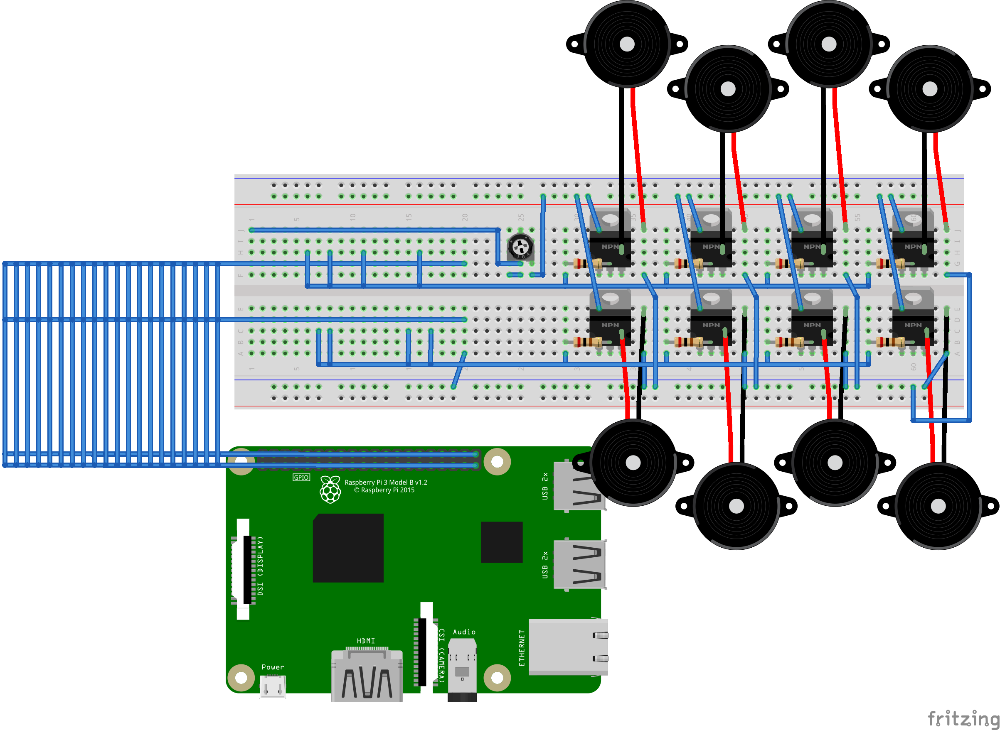

# Raspberry Piで音楽を演奏する

[Googleスライド](https://docs.google.com/presentation/d/1v06TiHg_VfW_GpwTSDZcnkdz5-jW30KUHXwWN1498sA/)

## 必要なもの
* Raspberry Pi 3 Model B
* 発音部品: 以下を同時発音数の数だけ
  * パッシブブザー
    * https://www.amazon.co.jp/dp/B01AJQE1N6/
  * 抵抗 200Ω
  * 電界効果トランジスタ(FET): 2N7000
    * https://www.amazon.co.jp/gp/product/B018FRALXA/
* 半固定抵抗: ボリューム調節のため(オプション)
* ブレッドボードや配線用ジャンパワイヤ
  * https://www.amazon.co.jp/gp/product/B01M6ZFNSS/
* その他LANケーブル等

## 配線図

## 環境
* OS
  * Raspbian Stretch
* インストールするパッケージ
  * [pyenvの依存パッケージ](https://github.com/pyenv/pyenv/wiki/Common-build-problems)
    * make
    * build-essential
    * libssl-dev
    * zlib1g-dev
    * libbz2-dev
    * libreadline-dev
    * libsqlite3-dev
    * wget
    * curl
    * llvm
    * libncurses5-dev
    * libncursesw5-dev
    * xz-utils
    * tk-dev
* Python
  * pyenvでPython 3.6.3をインストール

## コンパイル

    cd gpiosound
    make

コンパイルでできるバイナリ
* gpiosound
  * GPIOピン1つを担当し、音が出るように出力レベルをトグルしまくるプロセス。
  * 標準入力から32bit浮動小数点数を読み取り、その値を周波数として音を出力する。
* writefloat
  * gpiosoundのテスト用ツール。
  * コマンドライン引数で指定した浮動小数点数を標準出力に出力する。
  * 周波数440Hzの音を2秒間鳴らす例:
    * `( ./writefloat 440.0; sleep 2 ) | ./gpiosound -o 18`

## 楽譜ファイルを演奏する

    cd python-musicbox
    python -m musicbox.main ../score/disksystem.txt
